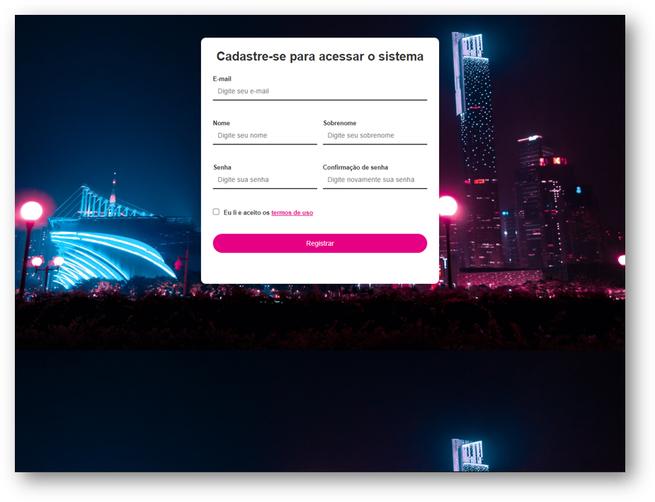

# Tela de login com HTML e CSS

Criando uma tela de login para aprender o uso de HTML, CSS e JavaScript.

### Branchs
1. `main`: tela de login com HTML e CSS
2. `javascript`: tela de cadastro com HTML/CSS e validações de JavaScript

- Referência: [Tela de login com HTML e CSS](https://www.youtube.com/watch?v=TpawIZdeMDI&list=PLnDvRpP8Bnew4ZYLYp47sD52OHQfHNdGB&index=2&ab_channel=MatheusBattisti-HoradeCodar)
